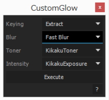

# CustomGlow

エフェクトを組み合わせて自作グローを作る。

## 使い方

1. **Keying**, **Blur**, **Toner**, **Intensity**を色々選択し、適当に組み合わせる。

1. **Execute**をクリックすると選択レイヤーにエフェクトが追加される。

## Dependencies

- [KIKAKU.Utils 1.0.0](https://github.com/atarabi/AfterEffects-Scripts/tree/master/Startup/KikakuUtils)
- [KIKAKU.UIBuilder 2.0.0](https://github.com/atarabi/AfterEffects-Scripts/tree/master/Startup/KikakuUIBuilder)

## Version

- v0.0.0