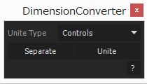

# DimensionConverter

プロパティの次元を変換する。

- 3(2)次元パラメータを1次元パラメータ3(2)つに分割する。

- 2次元パラメータと1次元パラメータを3次元パラメータ1つに結合する。

- 1次元パラメータ3(2)つを3(2)次元パラメータ1つに結合する。

## 使い方

- Unite Type

	- Controls
	
	エクスプレッション制御エフェクトを用いる。
	
	- Null
	
	エクスプレッション制御エフェクトの代わりにヌルを使う。
	
- Separate

	2,3次元パラメータから複数の1次元パラメータに分割する。
	
- Unite

	複数の1次元パラメータから2,3次元パラメータ（またはヌルの位置）に結合する。

## Dependencies

- KIKAKU.Utils 1.0.0
- KIKAKU.UIBuilder 2.0.0

## Version

- v0.1.0