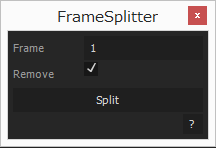

# FrameSplitter

nフレームごとにレイヤーを分割。

## 使い方

1. **Frame**で何フレームごとに分割するかを決める。

1. **Split**をクリックで実行。**Remove**がチェックされている場合、元の動画は取り除かれる。

## Dependencies

- [KIKAKU.Utils 1.0.0](https://github.com/atarabi/AfterEffects-Scripts/tree/master/Startup/KikakuUtils)
- [KIKAKU.UIBuilder 2.0.0](https://github.com/atarabi/AfterEffects-Scripts/tree/master/Startup/KikakuUIBuilder)

## Version

- v0.0.0