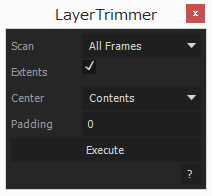

# LayerTrimmer

シェイプレイヤー、テキストレイヤーをコンテンツに応じてトリミングする。

## 使い方

### 基本

1. **Scan**で現在のフレームの境界のみをチェックするか、全フレームの境界をチェックするかを決める。

1. **Center**で、コンポジションの中心とコンテンツの中心のどちらを基準にするか決定する（テキストレイヤーはコンテンツ中心のみ）。

1. **Execute**をクリックで実行。

## Dependencies

- [KIKAKU.Utils 1.0.0](https://github.com/atarabi/AfterEffects-Scripts/tree/master/Startup/KikakuUtils)
- [KIKAKU.UIBuilder 2.0.0](https://github.com/atarabi/AfterEffects-Scripts/tree/master/Startup/KikakuUIBuilder)

## Version

- v0.0.0