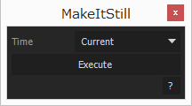

# MakeItStill

動画（タイムリマップ可能なレイヤー）を止める。

## 使い方

*Current*を選択し、**Execute**を押すと現在のレイヤー時間で停止。*inPoint*を選択すると、インポイントで停止。

## Dependencies

- [KIKAKU.Utils 1.0.0](https://github.com/atarabi/AfterEffects-Scripts/tree/master/Startup/KikakuUtils)
- [KIKAKU.UIBuilder 2.0.0](https://github.com/atarabi/AfterEffects-Scripts/tree/master/Startup/KikakuUIBuilder)

## Version

- v0.0.0