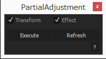

# PartialAdjustment

部分的調整レイヤー。

## 説明

調整レイヤーは、その調整レイヤー以下のレイヤー群をプリコンポしそのプリコンポしたものにエフェクトを掛けることと基本的には変わらない。
したがってレイヤー以下の全てを対象にするのではなく、ある一部分だけに調整レイヤーを掛けたい場合、その箇所だけをプリコンポすれば基本的には同じ効果が得られる。
しかし、当然その対象となったレイヤー群を弄りたい場合は、わざわざプリコンポ内にもぐる必要性があり手間となる。この手間の有無が、プリコンポではなく調整レイヤーを用いたい理由の一つであろう。
そこで、通常の調整レイヤーと同じように、わざわざプリコンポ内に移動することなく透過的に扱えるような仕組みを考える必要がある。

## 使い方

1. 対象となる連続したレイヤー群を選択し**Execute**ボタンをクリックすると、プリコンポの名前を求められるので入力する。すると、その名前のコンポジションが作られその中に対象レイヤーがコピーされる。この際に**Transform**がチェックされているとトランスフォームのプロパティが、**Effect**がチェックされているとエフェクトのプロパティが、元のレイヤーとピックウィップで繋がれる(よって、レイヤーの名前はユニークである必要がある)。この際、レイヤーのコメントにどのコンポにコピーされたかの情報が書き加えられる。

1. レイヤーに新たにエフェクトを追加する等々の既存のピックウィップだけでは整合性のとれない変化があった場合は、**Refresh**ボタンをクリックすると対象レイヤー群を再びコピーすることによって整合性を保つことが出来る。

## Dependencies

- [KIKAKU.JSON](https://github.com/atarabi/AfterEffects-Scripts/tree/master/Startup/KikakuJSON)
- [KIKAKU.Utils 1.0.0](https://github.com/atarabi/AfterEffects-Scripts/tree/master/Startup/KikakuUtils)
- [KIKAKU.UIBuilder 2.0.0](https://github.com/atarabi/AfterEffects-Scripts/tree/master/Startup/KikakuUIBuilder)

## Version

- v0.0.0