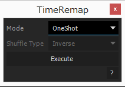

# TimeRemap

タイムリマップとエクスプレッション制御エフェクトで遊ぶ。

## 使い方

- Mode

	- OneShot
	
	角度制御エフェクトを用いてタイムリマップを弄る。0-360°の範囲のみ有効でそれ以外はクランプされる。
	
	- Loop
	
	角度制御エフェクトを用いてタイムリマップを弄る。360°ごとにループ。
	
	- Pingpong
	
	角度制御エフェクトを用いてタイムリマップを弄る。360°ごとにピンポン再生。
	
	- Stop
	
	チェックボックス制御エフェクトでタイムリマップを制御。チェックされたキーフレームで停止。
	
	- Shuffle
	
	チェックボックス制御エフェクトとスライダー制御エフェクトでタイムリマップを制御。チェックボックスで有効かを設定、スライダー制御エフェクトで何フレームを一塊にするかを決める。
	
		- Inverse
		
		一塊ごとに逆再生。
		
		- Random
		
		一塊ごとにランダム再生。
		
- Execute 

	実行。

## Dependencies

- KIKAKU.Utils 1.0.0
- KIKAKU.UIBuilder 2.0.0

## Version

- v0.1.0