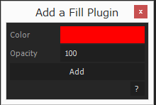
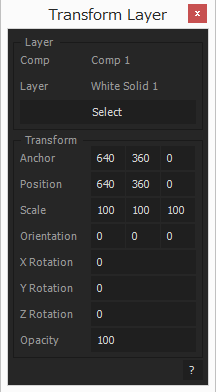

# KikakuUIBuilder

ScriptUIを楽に作る用ライブラリ。

## Usage

### 基本

- まず、UIBuilderのインスタンスを生成。第1引数にグローバルオブジェクト、第2引数にスクリプトの名前を渡す。第三引数はオプションで、作者、バージョン、幅、自動セーブの有無等を決める。

```
(function (global) {

  var builder = new KIKAKU.UIBuilder(global, 'Your Script', {version: '1.0.0', author: 'Your Name', width: 250});

})(this);
```

```
//options
{
  version: String, //バージョン。
  author: String, //作者。
  url: String, //URL。
  title: String, //スクリプトのタイトル。指定されない場合は第2引数の名前が使われる。
  resizeable: Boolean(default: true), //横方向にリサイズされるか。
  numberOfScriptColumns: Number(default: 2), //スクリプト用ボタンの一行あたりの最大許容個数。
  titleWidth: Number(default: 70), //パラメータのタイトル幅。
  width: Number(default:200), //UIの幅。
  help: Boolean(default: true), //ヘルプボタンを自動的に配置するか。
  autoSave: Boolean(default: false), //パラメータの自動セーブ機能を使用するか。
  fileType: String(default: 'txt'), //ファイルを使用する際のファイル形式。'txt'か'json'。
}
```
  
- 生成したUIBuilderインスタンスに`add`でパラメータを追加していく。第1引数はパラメータの種類で第2引数はパラメータの名前(ユニークである必要がある)。第3引数はデフォルト値で、第4引数はオプションで関数もしくはオブジェクトを渡す。UIBuilderインスタンスをそのまま返すのでメソッドチェーンで繋げていくことができる。

```
  builder.add('text', 'Text 1', 'Default Text')
         .add('number', 'Number 1', 0)
         .add('textarea', 'Textarea 1', '', {title: false, height: 150})
         .add('color', 'Color 1', [1, 0, 0, 1])
         .add('script', 'Execute', function () {});
```

```
  //options
  {
    callback: Function, //クリック、変化等時に呼び出される関数。optionsを関数で渡した場合はこれが単独で渡されたことになる。
    title: Bolean(default: true), //タイトル表示の有無。
    helpTip: String, //ヘルプチップ。
    onChanging: Function, //text, texts, textarea, textareas, slider専用。
    onDoubleClick: Function, //listbox, listboxes専用。
  }
```
#### パラメータの種類
|タイプ|値|説明|
|:-:|:-:|:-:|
|heading|String|見出し|
|separator|-|罫線|
|space|Number|スペース|
|panel|String|パネル。panelendと対。|
|panelend|-|パネルの終わりを明示。|
|text|String|テキスト。|
|texts|[String,]|複数のテキスト。|
|textarea|String|テキストエリア。|
|textareas|[String,]|複数のテキストエリア。|
|statictext|String|静的なテキスト。|
|statictexts|[String,]|複数の静的なテキスト。|
|number|Number|数値。(デフォルト値は{value: Number, minvalue: Number, maxvalue: Number}でも指定可能。)|
|numbers|[Number,]|複数の数値。|
|slider|Number|スライダ。(デフォルト値は{value: Number, minvalue: Number, maxvalue: Number}で指定。)|
|point|[Number, Number]|二次元の点。|
|point3d|[Number, Number, Number]|三次元の点。|
|file|String|ファイルパス。|
|folder|String|フォルダパス。|
|checkbox|Boolean|チェックボックス。|
|checkboxes|[Boolean,]|複数のチェックボックス。|
|radiobutton||ラジオボタン。|
|color|[Number, Number, Number, Number]|色。|
|colors|[[Number, Number, Number, Number],]|複数の色。|
|popup|[String,]|ポップアップ。|
|popups|[[String,],]|複数のポップアップ。|
|listbox|[String,]|リスト。|
|listboxes|[[String,],]|複数のリスト。|
|script|Function|スクリプト実行用ボタン。|
|help|String or Function|ヘルプボタン。|

```
  //Example
  builder
  .add('heading', 'Heading', 'UI Buildet Test')
  .add('separator', 'Separator')
  .add('space', 'Space', 10)
  .add('panel', 'Panel')
  .add('panelend', 'Panelend')
  .add('text', 'Text', 'text')
  .add('texts', 'Texts', ['text1', 'text2'])
  .add('textarea', 'Textarea', 'textarea')
  .add('textareas', 'Textareas', ['textarea1', 'textarea2'])
  .add('statictext', 'Statictext', 'statictext')
  .add('statictexts', 'Statictexts', ['statictext1', 'statictext2'])
  .add('number', 'Number', 0)
  .add('number', 'Number with MinMax', {value: 0, minvalue: 0, maxvalue: 100})
  .add('numbers', 'Numbers', [0, {value: 0, minvalue: -100, maxvalue: 100}])
  .add('slider', 'Slider', {value: 0, minvalue: -500, maxvalue: 500})
  .add('point', 'Point', [0, 0])
  .add('point3d', 'Point3d', [640, 360, 0])
  .add('file', 'File', '~/')
  .add('folder', 'Folder', '~/')
  .add('checkbox', 'Checkbox', true)
  .add('checkboxes', 'Checkboxes', [{text: 'A', value: false}, {text: 'B', value: true}])
  .add('radiobutton', 'Radiobutton', ['Radio 1', 'Radio 2', 'Radio 3'])
  .add('color', 'Color', [1, 0, 0])
  .add('colors', 'Colors', [[1, 0, 0], [0, 1, 0], [0, 0, 1]])
  .add('popup', 'Popup', ['Popup 1', 'Popup 2', 'Popup 3'])
  .add('popups', 'Popups', [['Left 1', 'Left 2', 'Left 3'], ['Right 1', 'Right 2', 'Right 3', 'Right 4']])
  .add('listbox', 'Listbox', ['Listbox 1', 'Listbox 2', 'Listbox 3'])
  .add('listboxes', 'Listboxes', [['Left 1', 'Left 2', 'Left 3'], ['Right 1', 'Right 2', 'Right 3', 'Right 4']])
  .add('script', 'Script', function () {});
```

- 基本としては、タイプがscriptのパラメータに実行したい関数を渡す感じなる。関数のコンテキストはUIBuilderインスタンスになっていて、`get`や`set`でパラメータの値を取得したり設定したり出来る。

```
  builder.add('script', 'Execute', function () {
    var number = this.get('Number 1'),
      textarea = this.get('Textarea 1'),
      color = this.get('Color 1');
     
    $.writeln(number);
    $.writeln(textarea);
    $.writeln(color);
  });
```

- 最後は`build`を呼ぶと実際にUIが生成される。

```
  builder.build();
```

```
//全貌
(function (global) {
  var builder = new KIKAKU.UIBuilder(global, 'Your Script', {version: '1.0.0', author: 'Your Name', width: 250});
  builder.add('text', 'Text 1', 'Default Text')
         .add('number', 'Number 1', 0)
         .add('textarea', 'Textarea 1', '', {title: false, height: 150})
         .add('color', 'Color 1', [1, 0, 0, 1])
         .add('script', 'Execute', function () {
           var number = this.get('Number 1'),
             textarea = this.get('Textarea 1'),
             color = this.get('Color 1');
           
           $.writeln(number);
           $.writeln(textarea);
           $.writeln(color);
         })
         .build();
})(this);
```


### 応用

#### 設定操作

##### UIBuilder#getSetting(key, default_value)

設定からキーの値を取得する。値が存在しない場合はデフォルト値が返る。

##### UIBuilder#saveSetting(key, value)

設定にキーの値を保存する。

##### UIBuilder#deleteSetting(key)

設定からキーの値を削除する。


#### ファイル操作

ファイル形式はコンストラクタのオプションで渡した形式で、またファイル自体は

Win: ~/AppData/Roaming/Atarabi/KikakuUIBuilder/Your Script Name  
Mac: ~/Library/Application Support/Atarabi/KikakuUIBuilder/Your Script Name

以下に保存される。

##### UIBuilder#getFileNames()

ファイル名を全て取得する。

##### UIBuilder#existsFile(file_name)

ファイル名のファイルが存在するか調べる(ファイル名は拡張子抜きで渡す、ファイル形式に基づいて自動的に付加される)。

##### UIBuilder#getFile(file_name)

ファイル内容を取得する。json形式の場合は自動的にparseされる。

##### UIBuilder#saveFile(file_name, data)

ファイルにデータを保存する。json形式の場合はデータは自動的にstringifyされる。

##### UIBuilder#deleteFile()

ファイルを削除する。


#### イベントディスパッチング

initイベントがUI生成時に、closeイベントがダイアログかパレット閉じられる際にディスパッチされる。

##### UIBuilder#on(type, fn)

イベントリスナーを登録。

##### UIBuilder#off(type, fn) 

イベントリスナーを削除。

##### UIBuilder#trigger(type)
 
イベントをディスパッチ。


#### API

##### UIBuilder#api(name, fn)

他のスクリプトから呼び出せるAPIを設定する。

``` 
(function (global) {
  new KIKAKU.UIBuilder(global, 'API Test')
    .add('text', 'Text', '')
    .api('set', function (text) {
      this.set('Text', text);
    })
    .build();
})(this);
```

とすると

```
KIKAKU.UIBuilder.API('API Test', 'set', 'This is text.');
```

のようにして呼び出せる。

### 例
**Example #1**



```
(function (global) {

  new KIKAKU.UIBuilder(global, 'Add a Fill Plugin', {version: '1.0.0', author: 'Kareobana', url: 'http://atarabi.com/'})
  .add('color', 'Color', [1, 0, 0, 1])
  .add('number', 'Opacity', {value: 100, minvalue: 0, maxvalue: 100})
  .add('script', 'Add', function () {
    var comp = app.project.activeItem;
    if (!(comp && comp instanceof CompItem)) {
      return alert('Select a comp.');
    }
    
    var layers = comp.selectedLayers;
    if (!layers.length) {
      return alert('Select a layer.');
    }
    
    var layer = layers[0];
    if (!(layer instanceof AVLayer || layer instanceof TextLayer || layer instanceof ShapeLayer)) {
      return alert('Select an AV layer.');
    }
    
    var effect = layer.Effects.addProperty('ADBE Fill'),
      color = this.get('Color'),
      opacity = this.get('Opacity') * 0.01;
      
    effect.property(3).setValue(color);
    effect.property(7).setValue(opacity);
  })
  .build();

})(this);
```

**Example #2**



```
(function (global) {
  
  //Lib
  var UIBuilder = KIKAKU.UIBuilder,
    Utils = KIKAKU.Utils;
    
  //global variables
  var do_select = false,
    layer = null;
  
  //functions
  function setValue(property, value, time) {
    if (property.numKeys) {
      property.setValueAtTime(time, value);
    } else {
      property.setValue(value);
    }
  }
  
  function transformLayer() {
    if (do_select) {
      return;
    }
    
    try {
      if (layer === null) {
        return alert('Select a layer');
      }
    } catch (e) {
      layer = null;
      this.set('Comp Name', '');
      this.set('Layer Name', '');
      return alert('The layer is invalid');
    }
    
    try {
      app.beginUndoGroup('Transform Layer');
      var time = layer.time;
      setValue(layer.transform.anchorPoint, this.get('Anchor'), time);
      setValue(layer.transform.position, this.get('Position'), time);
      setValue(layer.transform.scale, this.get('Scale'), time);
      if (layer.threeDLayer) {
        setValue(layer.transform.orientation, this.get('Orientation'), time);
        setValue(layer.transform.xRotation, this.get('X Rotation'), time);
        setValue(layer.transform.yRotation, this.get('Y Rotation'), time);
        setValue(layer.transform.zRotation, this.get('Z Rotation'), time);
      } else {
        setValue(layer.transform.rotation, this.get('Z Rotation'), time);
      }
      setValue(layer.transform.opacity, this.get('Opacity'), time);
    } catch (e) {
      //pass
    } finally {
      app.endUndoGroup();
    }
  }

  new UIBuilder(global, 'Transform Layer', {version: '1.0.0', author: 'Kareobana', url: 'http://atarabi.com/'})
  .add('panel', 'Layer')
  .add('statictext', 'Comp Name', '', {
    title: 'Comp'
  })
  .add('statictext', 'Layer Name', '', {
    title: 'Layer'
  })
  .add('script', 'Select', function () {
    var selected_layer = Utils.getSelectedLayer();
    try {
      if (selected_layer === null) {
        throw new Error('Select a layer');
      } else if (!Utils.isAVLayer(selected_layer)) {
        throw new Error('Select an AV layer');
      }
      
      try {
        do_select = true;
        layer = selected_layer;
        this.set('Comp Name', layer.containingComp.name);
        this.set('Layer Name', layer.name);
        
        this.set('Anchor', layer.transform.anchorPoint.value);
        this.set('Position', layer.transform.position.value);
        this.set('Scale', layer.transform.scale.value);
        if (layer.threeDLayer) {
          this.set('Orientation', layer.transform.orientation.value);
          this.enable('Orientation');
          this.set('X Rotation', layer.transform.xRotation.value);
          this.enable('X Rotation');
          this.set('Y Rotation', layer.transform.yRotation.value);
          this.enable('Y Rotation');
          this.set('Z Rotation', layer.transform.zRotation.value);
          this.enable('Z Rotation');
        } else {
          this.disable('Orientation');
          this.disable('X Rotation');
          this.disable('Y Rotation');
          this.set('Z Rotation', layer.transform.rotation.value);
          this.enable('Z Rotation');
        }
        this.set('Opacity', layer.transform.opacity.value);
      } catch (e) {
        //pass        
      } finally {
        do_select = false;
      }
    } catch (e) {
      layer = null;
      this.set('Comp Name', '');
      this.set('Layer Name', '');
      alert(e);
    }
  })
  .add('panelend', 'Layer End')
  .add('panel', 'Transform')
  .add('point3d', 'Anchor', [640, 360, 0], transformLayer)
  .add('point3d', 'Position', [640, 360, 0], transformLayer)
  .add('numbers', 'Scale', [100, 100, 100], transformLayer)
  .add('numbers', 'Orientation', [0, 0, 0], transformLayer)
  .add('number', 'X Rotation', 0, transformLayer)
  .add('number', 'Y Rotation', 0, transformLayer)
  .add('number', 'Z Rotation', 0, transformLayer)
  .add('number', 'Opacity', {value: 100, minvalue: 0, maxvalue: 100}, transformLayer)
  .add('panelend', 'Transform End')
  .build();

})(this);
```

## Dependencies

- [KIKAKU.JSON](https://github.com/atarabi/AfterEffects-Scripts/tree/master/Startup/KikakuJSON)
- [KIKAKU.FileManager 0.0.0](https://github.com/atarabi/AfterEffects-Scripts/tree/master/Startup/KikakuFileManager)
- [KIKAKU.SettingManager 0.0.0](https://github.com/atarabi/AfterEffects-Scripts/tree/master/Startup/KikakuSettingManager)
- [KIKAKU.EventDispatcher 0.0.0](https://github.com/atarabi/AfterEffects-Scripts/tree/master/Startup/KikakuEventDispatcher)

## Version

- v2.0.1 PARAMETER_TYPEの追加
- v2.0.0